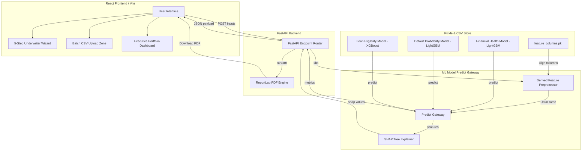
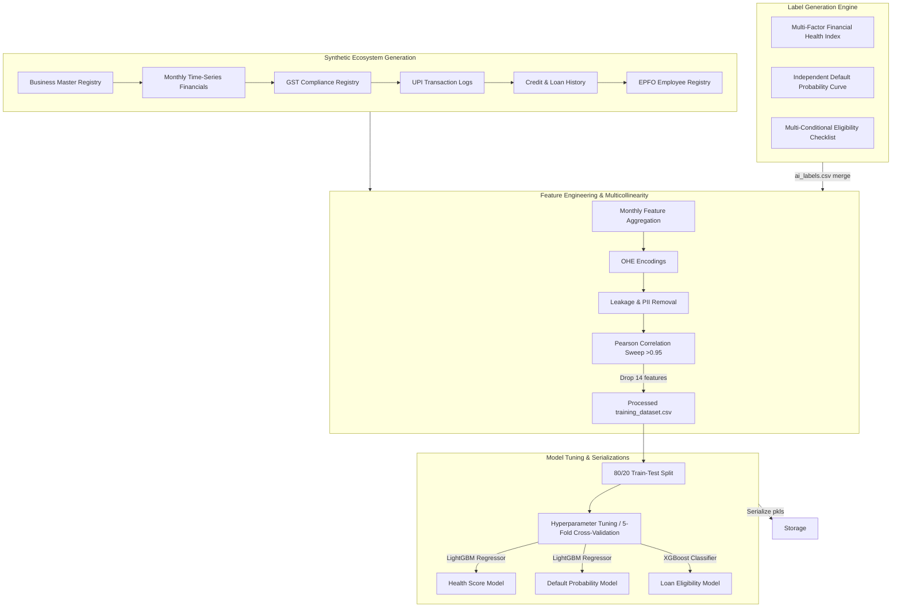

# 🏦 IDBI CreditSense
> **Predict • Explain • Approve**
> *AI-Powered MSME Credit Risk Underwriting & Portfolio Intelligence Platform*

---

[](https://www.python.org/)
[](https://react.dev/)
[](https://fastapi.tiangolo.com/)
[](https://vite.dev/)
[](https://tailwindcss.com/)
[](https://shap.readthedocs.io/)
[](https://xgboost.readthedocs.io/)
[](https://lightgbm.readthedocs.io/)
[](LICENSE)

---

## 📋 Table of Contents
1. [Project Overview](#-project-overview)
2. [Problem Statement](#-problem-statement)
3. [Key Features](#-key-features)
4. [System Architecture](#%EF%B8%8F-system-architecture)
5. [Machine Learning Pipeline](#%EF%B8%8F-machine-learning-pipeline)
6. [Folder Structure](#-folder-structure)
7. [Technology Stack](#-technology-stack)
8. [Explainable AI (SHAP) Integration](#-explainable-ai-shap-integration)
9. [Credit Underwriting Workflow](#-credit-underwriting-workflow)
10. [API Endpoints](#-api-endpoints)
11. [Model Information](#-model-information)
12. [Validation Results](#-validation-results)
13. [Installation & Run Guide](#-installation--run-guide)
14. [Live Demo Links](#-live-demo-links)
15. [Screenshots & Visual Assets](#-screenshots--visual-assets)
16. [Future Scope](#-future-scope)
17. [Author](#-author)
18. [License](#-license)
19. [Acknowledgements](#-acknowledgements)

---

## 🌟 Project Overview
**IDBI CreditSense** is an enterprise-grade, explainable AI (XAI) risk underwriting platform designed for modern commercial banks and financial institutions. The system evaluates the creditworthiness of MSMEs (Micro, Small, and Medium Enterprises) by ingesting operational, tax, transaction, and historical credit telemetry, predicting financial health, classifying risk ratings, and generating automated limit recommendations. 

By utilizing tree-based machine learning ensembles (LightGBM, XGBoost, and CatBoost) along with SHAP (SHapley Additive exPlanations), the platform moves beyond black-box ML models to deliver transparent, compliant, and auditable credit decisions.

---

## 🎯 Problem Statement
In traditional banking, credit underwriting for MSMEs is constrained by:
*   **Data Scarcity**: MSMEs often lack detailed audited financial records, leading to manual, slow, and subjective reviews.
*   **Black-Box AI Risks**: Modern ML models predict defaults with high accuracy but fail to explain *why* a decision was made, violating regulatory compliance guidelines (e.g., Basel norms).
*   **Target Leakage & Disconnected Data**: Static, score-card systems create correlation leakage and ignore critical repayment defaults, late EMI payments, digital transactions, and workforce attrition trends.

**IDBI CreditSense** solves this by unifying GST, UPI, employee details, and credit logs into a single, multi-factor, explainable risk dashboard.

---

## ✨ Key Features
*   **Multi-Step Underwriting Wizard**: A spring-animated, 5-step stepper that captures Business Profiles, Financial Statement metrics, GST filings, Digital UPI logs, and active Credit Liabilities.
*   **AI Processing Screen**: An async visual CPU processing stage with simulated pipeline task tick indicators.
*   **Multi-Factor Credit Risk Rating**: Translates composite financial and liability deficits into 5 standard Basel-compliant risk brackets (Excellent, Low Risk, Medium Risk, High Risk, Critical Risk).
*   **Explainable AI (SHAP) Visualizer**: Side-by-side positive and negative driver analysis showing the exact contribution of each parameter to the final health score.
*   **Dynamic Custom Advisories**: Generates custom bank advisories and risk flag callouts based on real-time inputs (e.g., late EMI alerts, GST filing compliance warnings).
*   **Real-Time Report PDF Compiler**: Generates downloadable, styled letter-format PDF evaluation audits with confidential watermarks, canvas board grids, and page numbers.
*   **Bulk CSV Batch Processor**: Underwrites entire portfolios of accounts in parallel via a drag-and-drop CSV parser.
*   **Executive Banking Portfolio Dashboard**: Visualizes overall portfolio health, risk distributions, regional/state credit exposure, and global feature importances.

---

## 🖥️ System Architecture



---

## ⚙️ Machine Learning Pipeline



---

## 📁 Folder Structure

```
├── backend/                        # FastAPI Web Server
│   ├── main.py                     # API Entrypoint (Endpoints, CORS)
│   ├── ml_engine.py                # Preprocessor, Predict Gateway, SHAP
│   ├── pdf_engine.py               # ReportLab PDF Report Generator
│   ├── schemas.py                  # Pydantic Request/Response Models
│   └── requirements.txt            # Backend Package Dependencies
├── frontend/                       # React client application
│   ├── src/
│   │   ├── assets/                 # SVGs, Layout Banners
│   │   ├── components/             # Reusable UI widgets (KPICard, ScoreGauge, etc.)
│   │   ├── contexts/               # Session Auth Providers
│   │   ├── layouts/                # Main Dashboard frame, active links anim
│   │   ├── pages/                  # Route views (Dashboard, Assessor, Batch, etc.)
│   │   ├── services/               # Fetch API wrapper (api.js)
│   │   ├── App.jsx                 # Route configurations
│   │   └── main.jsx                # DOM bootstrap
│   ├── package.json                # Frontend Package Dependencies
│   └── vite.config.js              # Vite bundler options
├── models/                         # Serialized ML components
│   ├── best_health_model.pkl       # Predicts Financial Health Score (LightGBM)
│   ├── best_default_model.pkl      # Predicts Default Probability (LightGBM)
│   ├── best_loan_model.pkl         # Predicts Credit Eligibility (XGBoost)
│   └── feature_columns.pkl         # Expected 63-column feature order
├── output/                         # Generated synthetic datasets & plots
│   ├── plots/                      # Validation curves and importances
│   └── training_dataset.csv        # Processed merged training dataset
├── generate.py                     # Orchestrator for data generation
├── feature_engineering.py          # Formats aggregations, OHE, multicollinearity drops
├── train_model.py                  # Model training, cross-validation, evaluation pipeline
├── validate_underwriting.py        # Automated test verification suite
├── app.py                          # Legacy Streamlit risk console
├── requirements.txt                # ML Pipeline python package dependencies
├── LICENSE                         # MIT License
└── README.md                       # Comprehensive project guide
```

---

## 🛠️ Technology Stack

| Component | Framework / Library | Purpose |
| :--- | :--- | :--- |
| **Frontend UI** | React 19.2, JavaScript | Responsive client interfaces & wizards |
| **UI Styling** | Vanilla CSS, TailwindCSS | Styling system with responsive grids |
| **Animations** | Framer Motion 12.4 | Dynamic spring micro-interactions |
| **Charts** | Recharts 3.9 | Portfolio distributions, curves, and analytics |
| **Backend API** | FastAPI 0.110.0 | High-performance async REST endpoint routing |
| **Server Engine** | Uvicorn 0.28.0 | ASGI web server implementation |
| **PDF Reports** | ReportLab 4.5.1 | Custom canvas-draw vector document generator |
| **ML Modeling** | XGBoost, LightGBM, CatBoost | Ensemble gradient boosting regressors/classifiers |
| **Explainable AI** | SHAP 0.52.0 | Shapley local contribution driver explanations |
| **Data Pipelines** | Pandas, Numpy, Scikit-learn | Time-series aggregates, OHE, data splitting |

---

## 💡 Explainable AI (SHAP) Integration
In banking, approving or rejecting a loan without explanation is a significant compliance issue. **IDBI CreditSense** integrates `shap` directly into the single assessment endpoint:
1.  During prediction, a local SHAP explainer (`shap.TreeExplainer`) receives the 63-column preprocessed DataFrame.
2.  SHAP calculates the exact margin contribution ($f(x) - E[f(x)]$) for each feature.
3.  The backend splits these into **Top 3 Positive Drivers** (supporting creditworthiness) and **Top 3 Negative Drivers** (depressing the health score) and returns their display names and normalized impacts.

---

## 🔄 Credit Underwriting Workflow

```
[Enter Wizard Data] ➔ [GST & UPI Validations] ➔ [Active Credit Limits & EMIs Check] 
                                                        │
                                                        ▼
[Fail Compliance Overs?] ➔ YES ➔ [Auto-Lock Status: REJECTED]
         │
         NO
         ▼
[Assemble 63 Preprocessed Features] ➔ [XGBoost / LightGBM Ensembles]
                                                        │
                                                        ▼
[Generate Dynamic Advisory Bullets] ➔ [Compile Real-Time Report PDF] ➔ [Download Assessment Report]
```

---

## 🔌 API Endpoints

### 1. Evaluate Credit Risk (`POST /api/predict`)
*   **Request Type**: `JSON` (Matches `schemas.MSMERequest` specifications)
*   **Description**: Preprocesses inputs, calculates XGBoost/LightGBM ratings, and extracts SHAP positive/negative drivers.
*   **Response Payload**:
    ```json
    {
      "score": 77.9,
      "risk_category": "Excellent",
      "default_probability": 0.2269,
      "eligible": true,
      "max_loan": 1560000.0,
      "top_positive": [
        { "feature": "GST_OnTime_Rate", "impact": 2.15, "display_name": "GST On-Time Filing Rate" }
      ],
      "top_negative": [
        { "feature": "Outstanding_Principal_Total", "impact": -1.45, "display_name": "Outstanding Principal Debt" }
      ]
    }
    ```

### 2. Batch Credit Assessment (`POST /api/predict/batch`)
*   **Request Type**: `Multipart/Form-Data` (CSV ledger containing a `Business_ID` index and matching raw columns)
*   **Description**: Evaluates entire corporate customer spreadsheets in parallel.

### 3. Global Analytics (`GET /api/analytics/global`)
*   **Description**: Loads model global feature importances, cross-validation metrics, and correlation grids for Recharts heatmaps.

### 4. Export Evaluation Audit PDF (`POST /api/report/pdf`)
*   **Request Type**: `JSON` (Matches request inputs)
*   **Response**: `Application/PDF` (Raw streaming bytes containing the vector report)

---

## 📊 Model Information

The platform operates three core ensembles trained and evaluated on the processed 25,000-business dataset. Exact testing metrics (from [model_metrics.csv](model_metrics.csv)) are documented below:

| Target Model | Task Type | Winning Estimator | Key Hyperparameters | Test Metrics |
| :--- | :--- | :--- | :--- | :--- |
| **Financial Health Score** | Regression | **LightGBM** | `max_depth: 8`, `num_leaves: 63`, `n_estimators: 150` | $R^2: \mathbf{0.9942}$<br>MAE: $0.3203$<br>RMSE: $0.5050$ |
| **Default Probability** | Regression | **LightGBM** | `max_depth: 8`, `num_leaves: 63`, `n_estimators: 150` | $R^2: \mathbf{0.9968}$<br>MAE: $0.0033$<br>RMSE: $0.0051$ |
| **Loan Eligibility** | Classification | **XGBoost** | `max_depth: 8`, `n_estimators: 100`, `learning_rate: 0.05` | ROC-AUC: $\mathbf{0.9998}$<br>Accuracy: $99.80\%$<br>F1-Score: $0.9990$ |

---

## 📈 Validation Results

All model checkpoints are validated against three target compliance profiles inside [validate_underwriting.py](validate_underwriting.py):

*   **Case 1 (Excellent Enterprise)**:
    *   *Features*: No defaults, 0 EMI delays, 30M turnover, 98% GST compliance, IT sector.
    *   *Metrics*: Health Score = **`96.46`**, Decision = **`APPROVED`**, Limit = **`7,230,000.00 INR`**.
*   **Case 2 (Average Traders)**:
    *   *Features*: 1 late EMI payment, 0 defaults, 8M turnover, 88% GST compliance, Retail sector.
    *   *Metrics*: Health Score = **`77.89`**, Decision = **`APPROVED`**, Limit = **`1,560,000.00 INR`**.
*   **Case 3 (Distressed Construction)**:
    *   *Features*: 1 past default history, 8 EMI delays, 6M turnover, 50% GST compliance, Construction.
    *   *Metrics*: Health Score = **`20.61`**, Decision = **`REJECTED`**, Limit = **`0.00 INR`**.

---

## 🚀 Installation & Run Guide

### 1. Clone the Repository
```bash
git clone https://github.com/Tanaypai123/IDBI-CreditSense.git
cd IDBI-CreditSense
```

### 2. Setup the FastAPI Backend
```bash
# Navigate to the backend folder
cd backend

# Install dependencies
pip install -r requirements.txt

# Start the uvicorn server (Default port: 8000)
uvicorn main:app --reload --port 8000
```

### 3. Setup the React Frontend
```bash
# Navigate to the frontend folder
cd ../frontend

# Install node dependencies
npm install

# Start the Vite development server (Default URL: http://localhost:5173)
npm run dev
```

### 4. Run Automated Underwriting Tests
```bash
# From the project root directory
python3 validate_underwriting.py
```

---

## 🌐 Live Demo Links

*   **Live Frontend**: `[Placeholder: Link to hosted Vercel/Netlify frontend]`
*   **Live Backend API Gateway**: `[Placeholder: Link to hosted Render/AWS FastAPI endpoint]`
*   **Platform Pitch / Walkthrough Video**: `[Placeholder: Link to Hackathon Demonstration Video]`

---

## 🖼️ Screenshots & Visual Assets

### Model Validation Curves (Auto-Generated during training)
Below are validation curves demonstrating model alignment:

#### 1. ROC-AUC Curves


#### 2. Actual vs. Predicted Health Scores


#### 3. Feature Importance Ratings


#### 4. Top 20 Correlation Heatmap


---

### UI Screenshots Placeholders (To be captured from local browser)

*   **Landing Page**: `[Screenshot Placeholder: Landing Page showing Hero workflow timeline and trust badges]`
*   **Credit Console**: `[Screenshot Placeholder: Console overview displaying 6 KPI cards, Node Health, and Recent Audits]`
*   **Underwriter Wizard**: `[Screenshot Placeholder: 5-step stepper forms for Statutory, Statement, GST, UPI, and Liabilities]`
*   **Processing Screen**: `[Screenshot Placeholder: CPU compiler stage showing active status tickers]`
*   **Results Dashboard**: `[Screenshot Placeholder: Concentric health dials, Credit Risk Rating card, and SHAP positive/negative driver columns]`
*   **Portfolio Analytics**: `[Screenshot Placeholder: Credit Risk Rating Pie-Chart distribution and Regional/Sector Risk grids]`
*   **Batch Processing**: `[Screenshot Placeholder: Drag-and-drop CSV upload zone and Batch result listings]`
*   **Settings**: `[Screenshot Placeholder: Telemetry parameters and system model details]`

---

## 🔮 Future Scope
*   **Unified Bank API Integration**: Connect directly with GSTN API, UPI payment gateways, and banking core networks for real-time validation.
*   **AI Document Parser (OCR)**: Integrate optical character recognition models to auto-parse PDF bank statements and GST return forms.
*   **Dynamic Model Registry**: Implement MLflow or DVC for automated retraining, version tracking, and live model updates.

---

## 👤 Author
*   **Tanay Sharma**
    *   GitHub: [Tanaypai123](https://github.com/Tanaypai123)
    *   *Built for the IDBI Innovate Hackathon 2026.*

---

## 📄 License
This project is licensed under the MIT License - see the [LICENSE](LICENSE) file for details.

---

## 🤝 Acknowledgements
*   **IDBI Innovate Hackathon 2026** committee for the problem statement.
*   **Shapley Additive Explanations (SHAP)** creators for local interpretability frameworks.
*   **ReportLab** team for vector PDF layout rendering tools.
